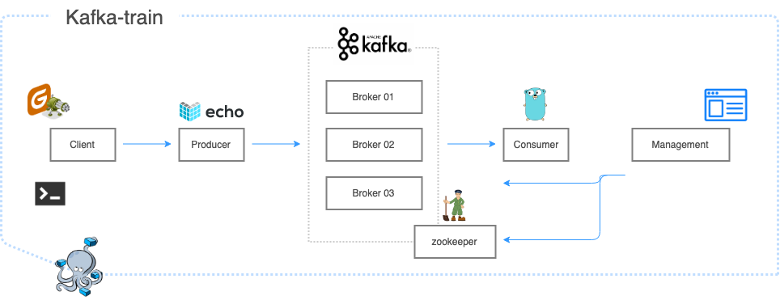

# Kafka-train

## What is Kafka-train

* easy learn how kafka (producer+consumer) works 
* easy to run. (what you need to do is only docker-compse up..!!)



## How to run
* How to run

```
docker run -it --rm \
-v /<path>/github/kafka-train/gatling/user-files:/opt/gatling/user-files \
-v /<path>/github/kafka-train/gatling/results:/opt/gatling/results \
denvazh/gatling
```

```
curl -X POST \
  -H 'Content-Type: application/json' \
  -d '{"body":"Test massage"}' \
  localhost:1323/kafka
```
