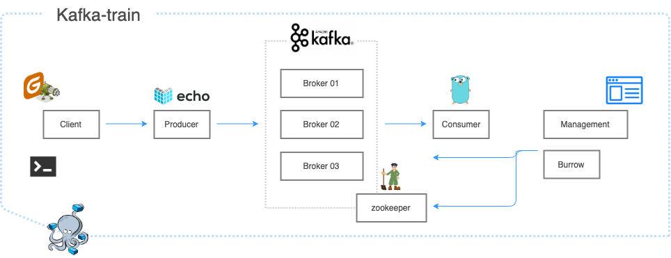

# Kafka-train

## What is Kafka-train

* easy to learn how kafka (producer+consumer) works
* easy to run. (what you need to do is only docker-compse up..!!)
* useful tools to manage kafka&zookeeper



## Tools

* [wurstmeister/zookeeper](https://hub.docker.com/r/wurstmeister/zookeeper)
* [wurstmeister/kafka](https://hub.docker.com/r/wurstmeister/kafka/)
* [tarosaiba/kafka-train-producer](https://hub.docker.com/r/tarosaiba/kafka-train-producer)
* [tarosaiba/kafka-train-consumer](https://hub.docker.com/r/tarosaiba/kafka-train-consumer)
* [tarosaiba/kafka-burrow](https://hub.docker.com/r/tarosaiba/kafka-burrow)
* [confluentinc/cp-kafka-rest:4.0.0](https://hub.docker.com/r/confluentinc/cp-kafka-rest)
* [landoop/kafka-topics-ui:0.9.3](https://github.com/lensesio/kafka-topics-ui)
* [sheepkiller/kafka-manager](https://github.com/sheepkiller/kafka-manager-docker)

## Quick start

### start

```
$ docker-compose up -d
```

### Produce

* producer message (5 messages)
    - send simple sequential strings (01,02,03,04,05...)
```
$ ./send_msg.sh 5
{"id":1,"body":"Massage: 01"}
{"id":2,"body":"Massage: 02"}
{"id":3,"body":"Massage: 03"}
{"id":4,"body":"Massage: 04"}
{"id":5,"body":"Massage: 05"}
```

* you can also send any message with this API
```
curl -X POST \
  -H 'Content-Type: application/json' \
  -d '{"body":"Test massage"}' \
  localhost:1323/kafka
```

### Consume

* see consumed messages
```
$ docker logs -f kafka-train_consumer_1
Kafka Broker -  kafka:9092
Kafka topic -  test_topic
subscribed to topic  test_topic
waiting for event...
Message Massage: 01
waiting for event...
Message Massage: 02
waiting for event...
Message Massage: 03
waiting for event...
Message Massage: 04
waiting for event...
Message Massage: 05
waiting for event...
```

